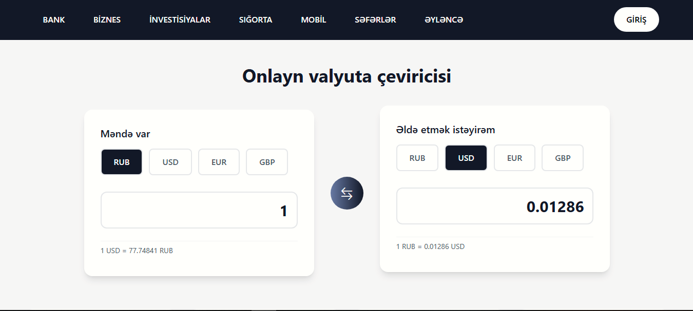
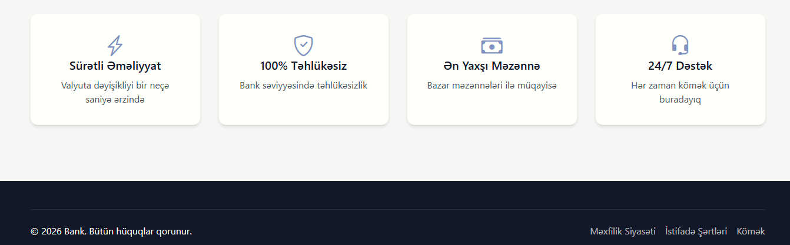

# 💱 Online Valyuta Çevirici

Bu layihə istifadəçilərə müxtəlif valyutalar arasında **real vaxt məzənnə** əsasında çevirmə aparmağa imkan verən **onlayn valyuta çevirici veb tətbiqidir**.

Platforma sadə interfeys, sürətli hesablamalar və aktual valyuta məlumatları ilə istifadəçi rahatlığını ön planda tutur.

---

## 🚀 Əsas Funksionallıqlar

- 💵 Müxtəlif valyutalar arasında çevirmə  
- 🔄 Dəqiq və sürətli hesablamalar  
- 📊 Sadə və istifadəçi dostu interfeys  

---

## 🌐 Canlı Demo
🔗 [Valyuta Çeviriciyə keçid](https://dashginasgarli.github.io/Project---Currency-converter-layout/)

---

## 🛠️ İstifadə Olunan Texnologiyalar

- **Frontend:** HTML, Tailwind CSS, JavaScript 
- **API:** Valyuta məzənnələri üçün RESTful API  
- **Deployment:** GitHub   
- **Versiya Kontrolu:** Git & GitHub  
---

## 🔌 İstifadə Olunan API

| API | İstifadə |
|----|---------|
| [Exchangerate.host](https://exchangerate.host/#/#docs) | Valyuta məzənnələrinin əldə olunması |

---
## 📸 Ekran Görüntüləri

---
## ⚠️ Məlumat

Bu layihədə istifadə olunan API-lər **sorğu limitinə** malikdir. Limit dolduqda tətbiq müvəqqəti olaraq **məlumat qaytarmaya bilər** və ya **xəta baş verə bilər**.

Bu halda:
- Bir müddət sonra yenidən cəhd edin  
- Və ya şəxsi API açarı istifadə edin
---
## 📞 Əlaqə

Layihə ilə bağlı sual və ya təklifləriniz üçün:

- **Email:** dashqinasgarli@email.com  
